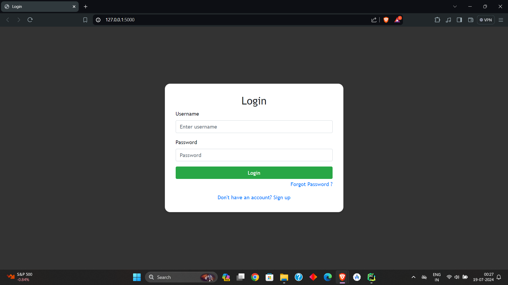
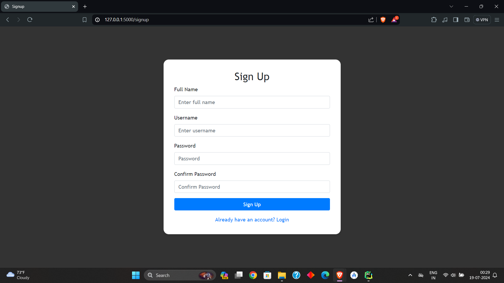
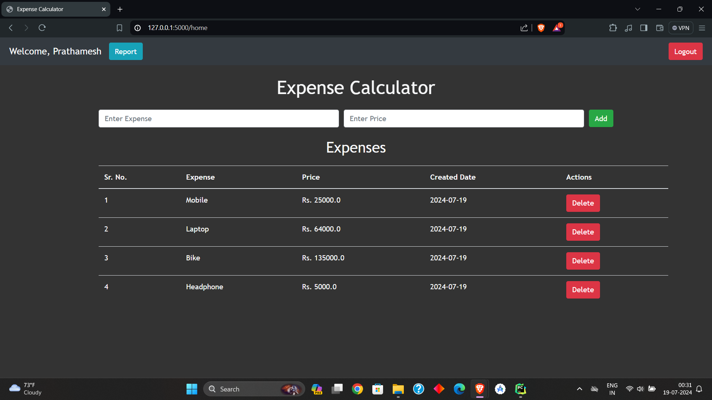
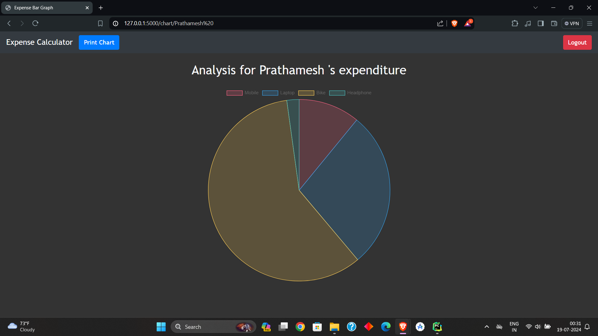

# Flask-Expense-Website
An Expense Website Using Flask Framework

## Features

- User authentication (login/register)
- Add, edit, and delete expenses
- View all expenses
- Generate expense reports with a pie chart
- Print expense reports

## Technologies Used

- **Flask**: Python web framework
- **SQLite**: Lightweight database for storing expenses
- **Bootstrap**: Front-end framework for styling
- **Chart.js**: JavaScript library for creating charts

## Installation

1. Clone the repository:

   ```bash
   git clone https://github.com/your-username/expense-app.git
   cd expense-app

2. Create and activate a virtual environment:

   ```bash
   python -m venv venv
   source venv/bin/activate  # On Windows use `venv\Scripts\activate`

## Usage

- Login/Register
- Navigate to http://localhost:5000 to access the app.
- Click on "Register" to create a new account.
- Once registered, log in using your credentials.

## Home (Expense Management)
- Add Expense: Click on "Add Expense" to add a new expense.
- Edit Expense: Click on the expense to edit it.
- Delete Expense: Click on the delete icon to remove an expense.

## Reports
- Navigate to the "Reports" section to view expense statistics.
- A pie chart will display the distribution of expenses.
- Print Report
- Click on "Print Report" to generate a printable version of the expense report.

## Screenshots


*Login Page*


*Login Page*


*Expense Management Interface*


*Reports Section*


## Contributing
Contributions are welcome! Please fork the repository and create a pull request with your improvements.

## License
This project is licensed under the MIT License - see the LICENSE file for details.
